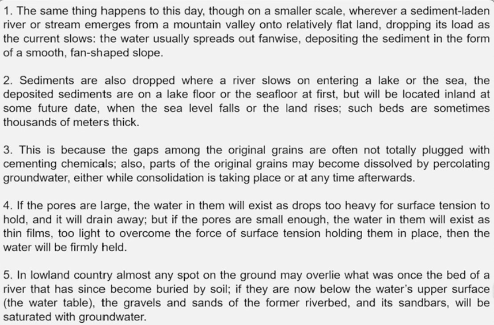

# Reading
## Types of Articles
* Classification 从各个学科or some what角度去研究某一个内容
* Comparision 以某一个时间节点前后对比；对比的背景；对比的展开
* Problem\Solution 提出问题；从不同角度回答\解决问题
* Cause\Effect  说一个结果，从不同方面分析原因，自然因素、人为因素。。。

## Signal words
* 转折；
* 对比；
* 总结；
* 强调；
* 因果；
* 定义；
* 有问；
* 有答；
* 顺序；

## Some words may be wrong
* 极端词：never, only, all, little, few;
* 最高级；
* 比较级；
* 副词：totally, completely, soon, well

## 7天精通长难句
https://www.bilibili.com/video/BV1T4411V71S/?spm_id_from=333.337.search-card.all.click&vd_source=d32278950acd876ff8440e3b3294f123
* 从分句子过多：基于信号词拆分；
* 插入成分：取舍；
* 生词；
* 虚拟语气：还原
### Day 1
* 